# GYROLL

**How far can you go?**

GYROLL is an endless 3D marble game for your phone. Tilt the phone to roll a heavy glass or metal marble along a narrow track floating in the void. The track twists, narrows, has holes, gaps and obstacles, and it slowly falls apart behind you. Don't fall off.

**▶ Play: [gyroll.vercel.app](https://gyroll.vercel.app/)** (best on a phone)

[](https://github.com/ErwannRobin/gyro/actions/workflows/ci.yml) [](LICENSE)

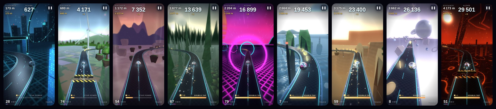

The whole game is **one self-contained `index.html` file** (about 375 KB, about 6 000 lines): HTML, CSS, JavaScript, GLSL shaders and synthesized audio.
- It uses no libraries and no external assets, and it needs no network to play.
- It is assembled from readable source files in [`src/`](src) by a tiny build script that has no dependencies.
- A few optional files next to it make it installable and nice to share: icons, a manifest, a service worker and a preview image.

---

## Features

- **Gyroscope control.** Tilt left/right to steer, forward to speed up, back to brake and roll backwards. It handles the iOS motion permission prompt, calibrates to your natural holding position, and smooths the sensor signal. With the gyroscope your fingers are free: drag on the screen to swing the camera around the ball (it eases back behind the ball when you let go), pinch to move it closer or farther (the distance is remembered), and double-tap to fire star power.
- **Touch control.** Choose **Gyroscope** or **Touch** in the options. Touch control is a floating joystick where you put your finger. If the sensors are missing or the permission is refused, the game switches to touch control and keeps that choice. On desktop you can use the arrow keys, WASD, ZQSD or drag with the mouse, and the mouse wheel zooms the camera.
- **Endless procedural track** that gets harder with distance:
  - straights, big curves, zigzags, hairpins and narrow passages
  - banked platforms, holes, gaps with jumps, boosters, posts and moving sliders
  - checkpoints about every 250 m, each on a calm, wide, straight pad, and coins to collect
  - The generator always leaves a safe line, so no section is impossible.
- **Two game modes:**
  - **Training**: one endless track to explore. After a fall, the next run (and the menu scene) starts again at the last checkpoint you passed, so you can go further each time. The track and the restart point are saved on the device. **↻ Reset track** on the menu (a small dark pill, readable over any sky) starts a fresh track from 0 m.
  - **Daily run**: everyone gets the same track on the same day, and every run starts from the beginning. The seed comes from the UTC date, and the daily best is saved separately. The link `?mode=daily` opens the daily run directly.
- **Star power.** Coins fill a gauge at the bottom of the screen. Coins taken in a row raise the coin multiplier (×2 after 4, ×3 after 8, ×4 after 12), so the gauge fills faster; missing a single coin resets it. When the gauge is full, flick the phone up quickly (or double-tap, press Space, or tap the gauge): glowing side rails appear, the ball lights up, the music speeds up and the score is doubled. The ball also smashes every post and moving slider it touches into flying pieces (+500 points each, doubled by star power) instead of bouncing off, and it mows grass tufts flat. The gauge then drains in about 6 seconds and the rails go away.
- **Kid mode (side rails).** A menu toggle adds a bumper fence along both edges of the track: a low bar, short posts and a glowing top bar as high as the ball's center. The ball bounces back instead of falling off the side. A very hard hit (above about 32 km/h sideways) still jumps the fence, and holes and gaps still count. Kid-mode runs keep their own best scores, and the game over screen, the share text and the share video all say "with side rails".
- **Nine worlds** that change every 500 m of track and blend smoothly into each other. After the last one, the list starts again:
  - **Tech** (0–500 m): towers with lit windows, beacons, a glowing grid below. By day it is a glass city under a clear blue sky with clouds; at night it keeps its dark neon look. The daily run always starts here, so the time of day shows from the first meter.
  - **Countryside** (500–1000 m): a sunny patchwork of fields and hedges far below, rows of tall cypresses, floating meadows with trees, wind turbines, hot-air balloons, rolling hills and white clouds
  - **Landscape** (1000–1500 m): sunset, floating rock islands, mountains, a sea of clouds
  - **Forest** (1500–2000 m): giant conifers in the morning mist (the track runs through their crowns), a canopy of round treetops far below, light shafts, fireflies
  - **Neon** (2000–2500 m): synthwave sun, neon grid, neon rings to roll through
  - **Sea** (2500–3000 m): open sea far below with swell, sun glitter and foam, sea stacks, red and green channel beacons, sailboats and lighthouses
  - **Desert** (3000–3500 m): golden dunes shaped by the wind, mesas, sandstone hoodoos, cacti and pyramids
  - **Abstract** (3500–4000 m): floating pastel primitives
  - **Chaos** (4000–4500 m): red storm, lava cracks, spinning shards, lightning
- **Parallax depth.** Objects in the foreground pass close to the track, structures sit in the midground, and slow-moving giant objects, the sky and a floor far below form the background. Fog, dust, light shafts and speed lines add to the sense of speed.
- **Real rolling physics:** acceleration, inertia, friction, gravity on slopes and banks, rail bounces, jumps and falls. There is no hard speed limit: the push gets weaker as you go faster, but it never stops.
- **Premium effects:**
  - a marble that mirrors the real world around it. A small cube map is rendered from the ball's center every frame, so it reflects the track, coins and scenery, not only the sky. Each skin is its own material:
    - **chrome and gold:** polished metal with fresnel, a sharp sun glint and machined seams with a light strip that show the roll
    - **glass:** reflection plus refraction through the sphere (the world appears upside down, like in a real marble), twisted coloured vanes inside and a sun caustic
    - **plasma:** a smoky glass shell over glowing veins at several depths and a hot core
    - **candy:** glossy clear coat over a coloured body with a soft subsurface look
  - a contact shadow and light spill on the deck
  - a speed trail and particles
  - bloom, radial speed blur and chromatic aberration when boosting
  - a lens flare when the sun is in view (none when something hides it)
  - slow motion when you fall
- **5 track skins** (neon carbon, steel & gold, wooden toy, ice marble, grass) **and 5 marble skins** (chrome, glass, gold, plasma, candy). You can change them from the menu options or the pause screen (in portrait; the landscape pause screen keeps only resume, sound and menu, in one column). The pickers show real pictures drawn with the game's own shaders: each marble as it looks in the current world, and each track skin on a short bend under the current sky. They are redrawn when the world or the track skin changes, one picture per frame.
- **Grass track.** A lawn with mowing stripes, clover, daisies, a stone curb and turf sides. It is not only a look: the ball rolls slower (on flat ground it tops out near 76 km/h instead of more than 120 km/h), the uneven ground nudges it sideways, and grass tufts on the track slow it down, kick it aside and make it bounce, with clippings flying. Tufts never sit on narrow ground, boosters, checkpoint pads or among obstacles. They are placed from the track seed without changing the track, so the daily run stays the same for everyone.
- **A light menu.** The menu shows only the GYROLL title, the tagline, the Training / Daily run switch, one **PLAY** button in the middle of the screen (the ball rolls into view below it) and an **Options** toggle at the bottom. Its parts rise into place one after the other when it opens.
- **Options.** The toggle raises a glass sheet with every setting: kid mode, controls (gyroscope or touch), time of day, track and marble skins, language and sound. PLAY and the Training / Daily run switch hide, the title shrinks into the top bar between the language and sound buttons, and an **About** button takes the switch's place. **Done** (or a tap outside the sheet) brings the light menu back. The selected option of each switch is marked by a pill that slides under it.
- **Time of day.** The sky shows a sun (a bright disc with a lens flare) or a moon (with seas, craters and today's phase, lit on the correct side). Four settings:
  - **Real time** (the default): the sun follows the local clock. It rises on the left, is highest around noon and sets on the right, lower in winter. At night the moon rises opposite it.
  - **Day**: each world keeps its own sun.
  - **Night**: a moon in each world.
  - **System**: day or night, following the dark mode of the device.
  At night the bright worlds turn to a moonlit blue with stars and a faint Milky Way, sunlight becomes moonlight, and neon lights, coins and the track lines glow. The city (the first world) switches to its own day look; the other worlds that are already dark stay almost the same. A low sun warms the light and the horizon.
- **About.** The story of the project and its concept, the real line count and size of `index.html` (the build writes them into the file), and links to the source code on GitHub and to [@diwann](https://x.com/diwann) on X. It opens with its own animation: a circle grows from the About button, a marble draws a neon track and keeps rolling along it, the numbers count up and the text rises line after line. ✕ or `Esc` closes it.
- **A still menu camera.** Changing the mode, kid mode, the track, a skin or the time of day on the menu never moves the camera: the camera keeps its place next to the ball, and the new world or sky appears with a short cross-fade. Kid mode only adds the rails to the same track.
- **Sound.** Every sound is synthesized with the Web Audio API, including the rolling sound, impacts, coins, checkpoints, boosts, falls, thunder and generative ambient music. Music and sound effects have separate toggles (white icons) and volume sliders.
- **Share my score.** During the run the game records a light timelapse. When you press **Share my score** at game over, it builds a short accelerated video (intro, run, fall, score card) with `MediaRecorder`; press **Share the video** when it is ready. On phones it is shared through the Web Share API; elsewhere it is downloaded. If video is not supported, a score-card image is used instead.
- **English and French**, detected from the browser language. You can switch on the menu; the menu layout never moves when you change the language or an option.
- **Look around on the menu.** Drag on the background to walk the camera around the ball (up and down too), and pinch (or use the mouse wheel) to zoom in on the marble or out on the world. When motion access is on (Android at once, iPhone after you allowed it once), turning the phone also walks the camera around the ball and tilting it raises or lowers the camera.
- **Built for phones:**
  - portrait first, landscape supported
  - no scrolling or zooming, large touch targets, readable in sunlight
  - screen stays awake while playing, pauses on focus loss
- **Adaptive quality.** Resolution, bloom, particles and scenery density adjust automatically to hold the frame rate. Repeated scenery is drawn with GPU instancing: about 35 draw calls per frame instead of about 105. The ball's reflection cube map is 256 px on computers and 128 px on phones (half of it redrawn each frame there), and it is turned off on the lowest level.
- **Installable app (PWA).** Add GYROLL to your home screen. It then opens full screen, locked in portrait so the screen does not rotate while you tilt, and it works offline.
- **Nice link previews.** Shared links show a preview image and a description.

## Screenshots

| Menu | Tech | Countryside | Landscape | Forest |
|---|---|---|---|---|
| 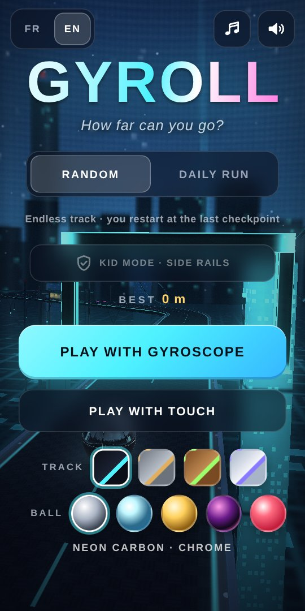 | 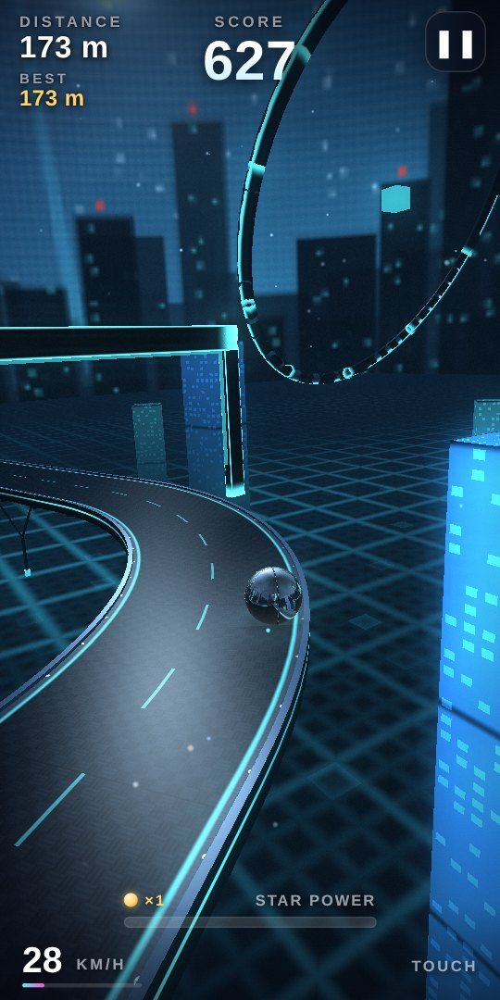 | 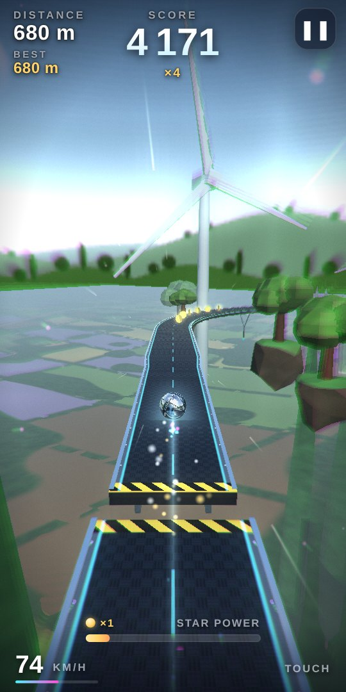 | 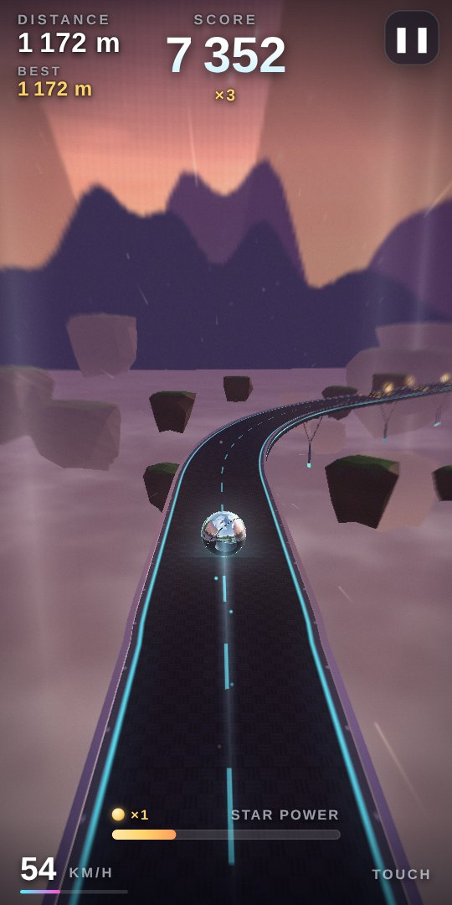 | 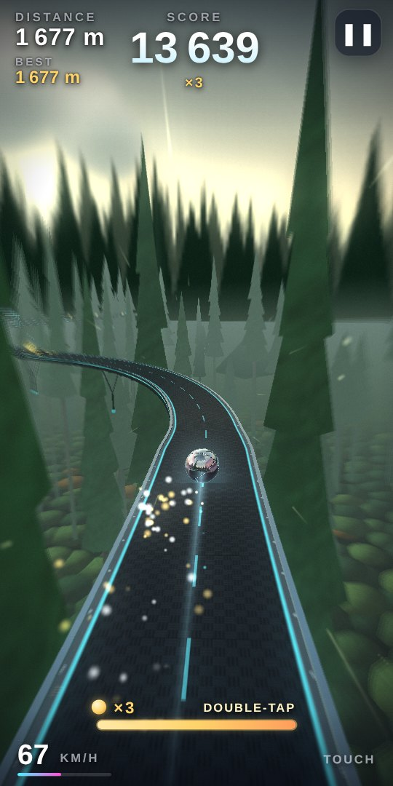 |

| Neon | Sea | Desert | Abstract | Chaos |
|---|---|---|---|---|
| 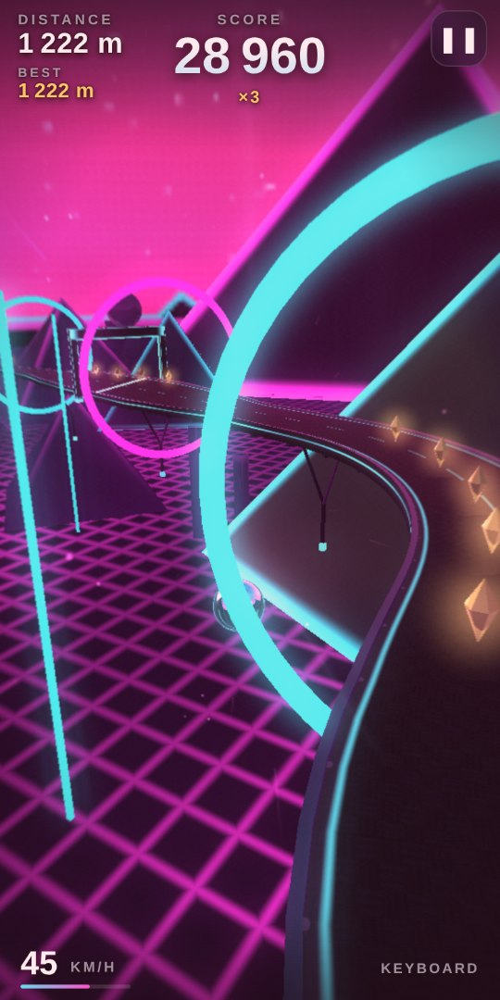 | 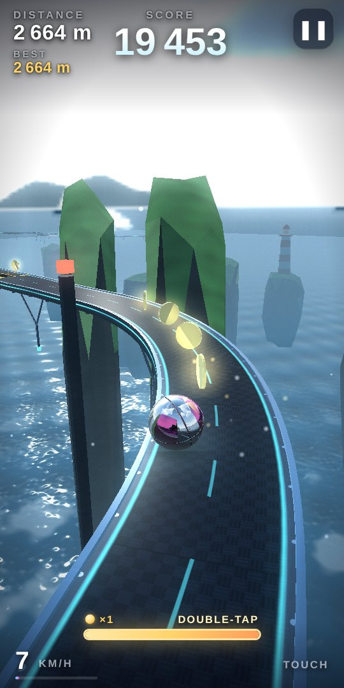 | 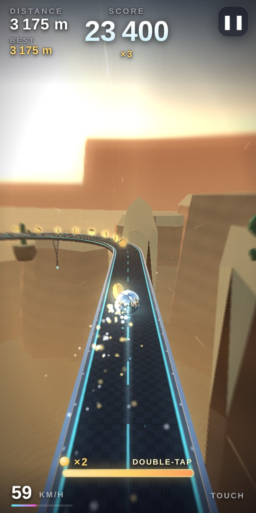 | 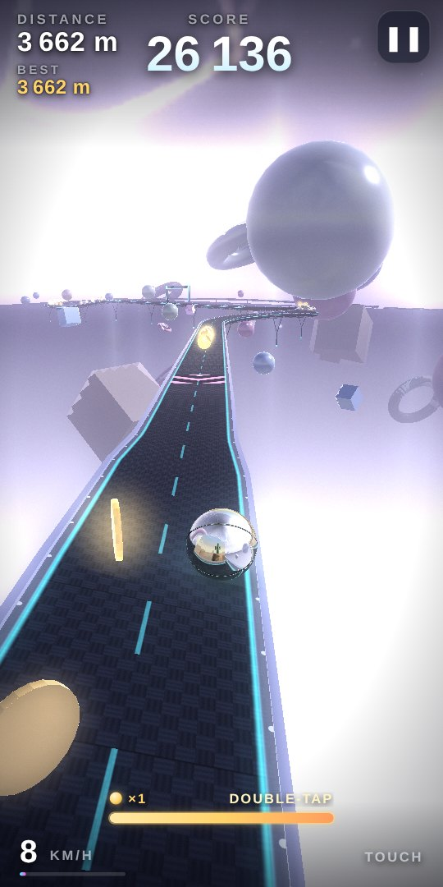 | 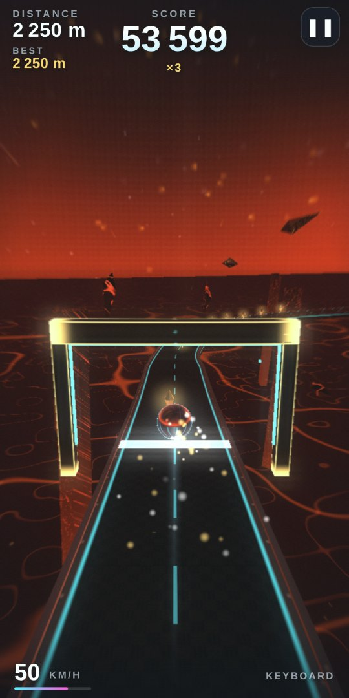 |

| Options | About | Grass track | Star power smash (kid mode) |
|---|---|---|---|
| 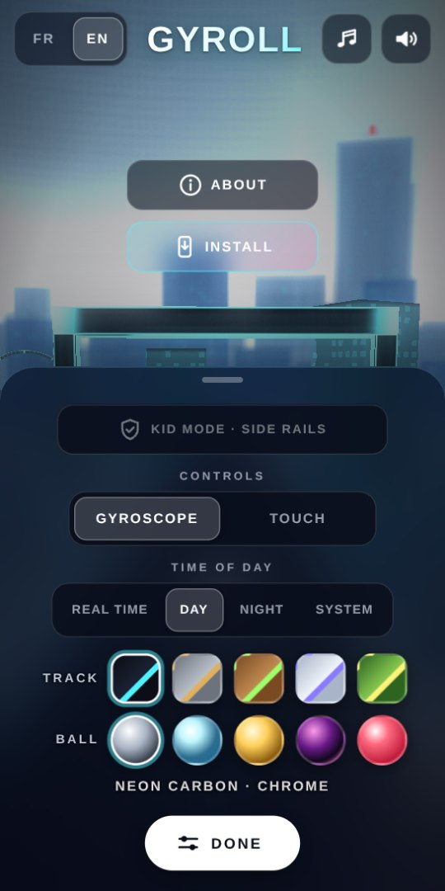 | 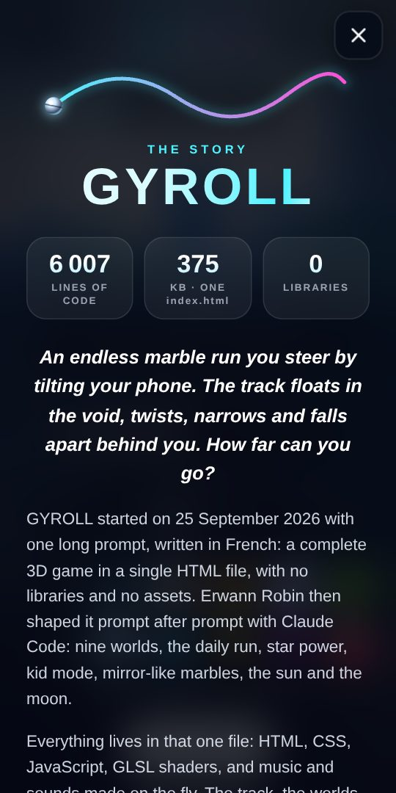 | 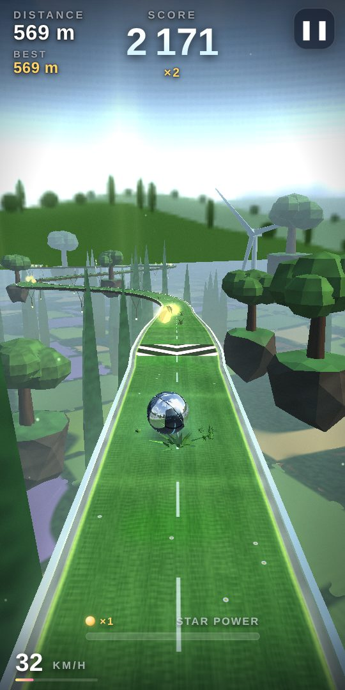 | 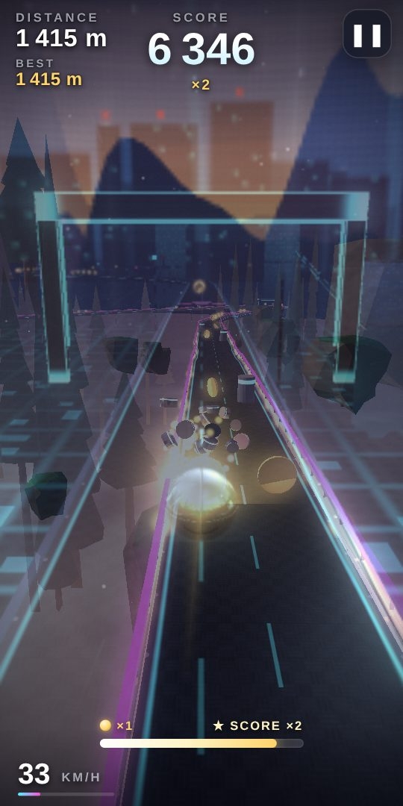 |

| Real time: morning sun | Night: moon over the sea | Night: countryside | Day: the city |
|---|---|---|---|
| 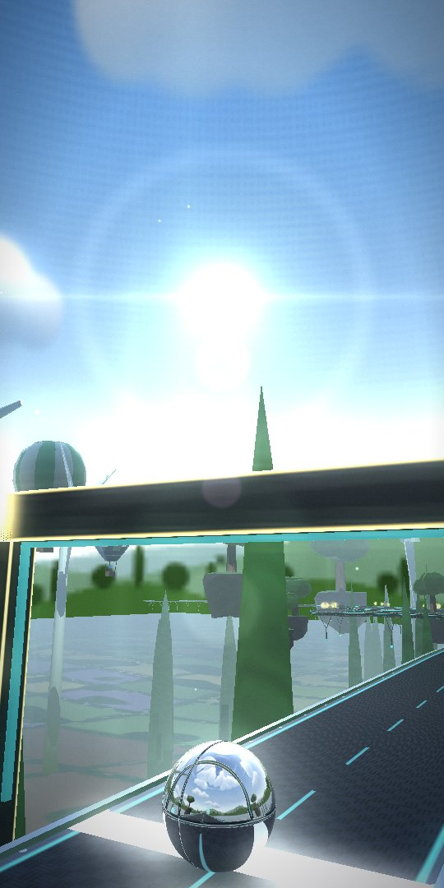 | 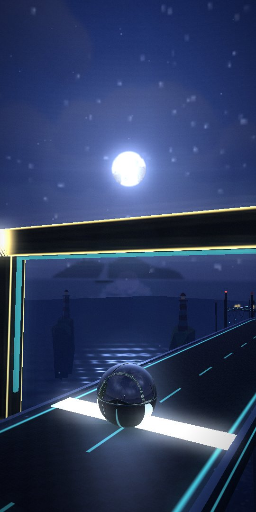 | 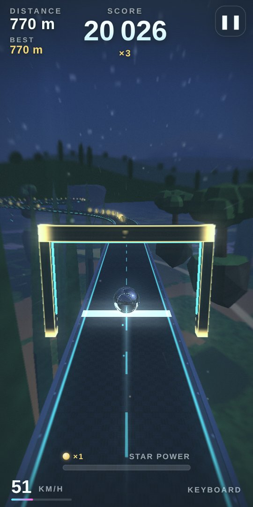 | 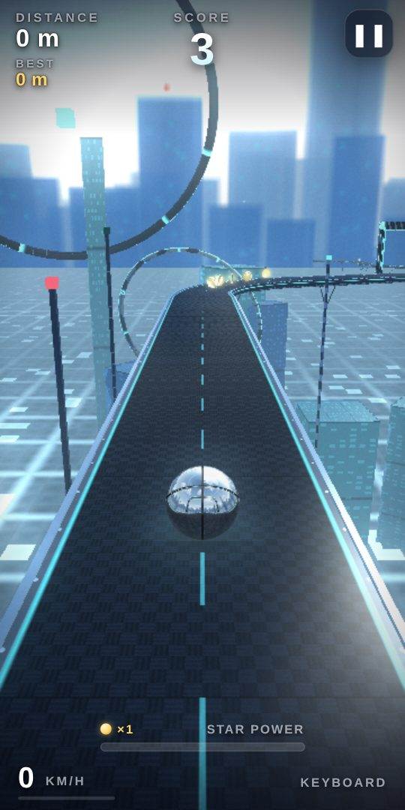 |

## Controls

| Input | Action |
|---|---|
| Tilt phone left / right | Steer |
| Tilt phone forward / back | Accelerate / brake and roll backwards |
| Touch and drag (touch control) | Virtual joystick |
| Drag · pinch (gyroscope control) | Turn the camera · zoom |
| Drag · pinch · mouse wheel (menu) | Walk the camera around the ball · zoom |
| Arrows · WASD · ZQSD | Keyboard control (desktop) |
| Mouse drag | Joystick (desktop) |
| Quick tilt up · double-tap · `Space` · tap the gauge | Start star power (when the gauge is full) |
| `P` / `Esc` | Pause / resume (`Esc` also closes the options and the About screen) |
| `Space` / `Enter` | Start / play again |

## Scoring

- **Distance** is the furthest point you have reached in this run (meters), counted from where the run started.
- **Score:** each meter is worth 10 points × a speed multiplier. The multiplier is ×2 above ~29 km/h, ×3 above ~43 km/h, ×4 above ~72 km/h or while boosting, and ×5 above ~108 km/h.
- **Coin:** 250 × the coin multiplier. **Checkpoint:** +1000.
- **Star power** doubles every point while it lasts.
- The track collapses behind you, so you can't stand still forever.

## Run it locally

- **Quick:** open `index.html` in a recent Chrome, Edge, Firefox or Safari on your computer.
- **With a local server** (needed for the installable app and offline mode):

  ```sh
  npm run serve        # http://127.0.0.1:4173/ (no install needed, Node 20+)
  ```

- **On a phone:** motion sensors only work on **HTTPS** pages, so use a hosted copy (see below). On plain HTTP the game still works, but falls back to touch control.

## Development

```
src/shell.html        page markup + CSS (the <head> and screens)
src/js/01-core.js     math, i18n, themes, world zones, daily seed, analytics
src/js/02-track.js    track storage + procedural generator
src/js/03-shaders.js  all GLSL shaders
src/js/04-…11-*.js    geometry, renderer, physics & camera, input & audio,
                      particles & environment, UI, replay/share, game loop
scripts/build.mjs     src/ → index.html (and --check for CI); writes the file's own
                      line count and size into BUILD_INFO for the About screen
scripts/serve.mjs     tiny static server
tests/                Playwright browser tests
sw.js, manifest.webmanifest, icons/, og.jpg   installable app + link preview
```

The files in `src/js/` are joined, in name order, into one classic `<script>`. Their top-level names are therefore shared between files.

```sh
npm install          # dev tools only: ESLint + Playwright (the game has no dependencies)
npm run build        # rebuild index.html after editing src/
npm run lint
npm test             # headless Chromium, software WebGL (first time: npx playwright install chromium)
npm run ci           # check + lint + test, same as GitHub Actions
```

Always commit `src/` **and** the rebuilt `index.html`; CI fails if they differ.

The tests drive the game loop step by step instead of waiting for real frames, so they are fast and stable even with software rendering. They cover:
- booting and a full keyboard run (play, pause, fall, game over, replay)
- NaN checks over a long run
- track feasibility over 4 km on many seeds
- daily-run determinism
- tilt directions, the touch fallback (which becomes the setting) and the control setting
- the camera under the finger: drag and pinch on the menu, look-around, pinch zoom and double tap in gyroscope play
- language switching, sound toggles and skins
- a menu layout that never moves when the language, mode, kid mode, sound, control, time of day or skin changes, and the sliding pills of the switches
- the share link and the share video
- all nine worlds rendering, and the loop back to the first one
- the installable app, including offline play
- kid mode, safety rails that give way to hard hits (kid rails hold more), and speed past 50 km/h
- coins, streak multiplier, star gauge, the tilt-up flick and star power, which smashes obstacles
- the grass track: slower rolling, uneven ground, tufts that slow and push the ball (and that star power mows), tufts only on safe ground, the same for everyone and never changing the track shape
- scenery staying out of the track corridor, including giant objects that drift onto it
- training mode restarting at the last checkpoint (and "reset track"), daily runs restarting from 0
- checkpoints on safe pads, at round distances
- the ball's reflection cube map facing the right way
- the share video only being made on request
- the menu camera following the phone
- the light menu (one PLAY in the middle) and the options sheet (the title moves into the top bar, the mode switch gives its place to About; Done or a tap outside closes it)
- the About screen: the story in both languages, the line count and size that match the real `index.html`, the links, the marble animation, closing with ✕ or `Esc`, and scrolling on a short landscape screen
- the landscape pause screen: one column without skin pickers that fits a short screen
- the time of day: the sun's path over the day and the year, the moon and its phase, night palettes, the city's day look, the setting and dark mode, the sun and moon discs, and all worlds rendering at night
- a menu camera that stays still when options change, and kid mode keeping the same world
- picker pictures drawn by the game, redrawn for a new world

## Deploy

It is a static site.

- **Vercel** (production: <https://gyroll.vercel.app/>): import the repository. `vercel.json` already sets the build (`node scripts/build.mjs`, nothing to install), the output folder (the repository root) and cache headers for the service worker. To get statistics, enable **Web Analytics** in the Vercel project settings.
- **GitHub Pages**: Settings → Pages → deploy from the `main` branch, root folder. The built `index.html` is committed, so no build step runs there.

If you fork the project, change the `PROD_URL` constant in `src/js/01-core.js`. It is the link used in shared scores, on the video end card and for analytics, and it also appears in the `og:` tags of `src/shell.html`.

## Privacy

- **No cookies, no accounts.** Best scores and settings stay in the browser (`localStorage`).
- **Anonymous statistics, official site only.** On `gyroll.vercel.app`, and only when "Do Not Track" is off, the game loads Vercel Web Analytics. It counts page views and sends a few anonymous game events:
  - `run_start`: game mode and control type
  - `game_over`: mode, world reached, distance rounded to 50 m
  - `share`: how the score was shared
  - `install`: whether the app was installed
- Local copies, forks and other domains send nothing.

## How it works

The game code lives in `src/js/` and is built into `index.html`. It is split into small classes:

| Part | Role |
|---|---|
| `TrackGenerator` | Seeded procedural sections (curves, zigzags, holes, gaps, obstacles…) with a difficulty ramp. The generated values are rate-limited so the geometry stays smooth, and a heading guard makes sure the track never loops back on itself. Grass tufts are placed from a hash of the row, apart from the section random numbers. |
| `Track` | Ring buffer of centerline samples and per-row solid intervals. Handles point-to-track projection and support tests. |
| `TrackMesher` | Builds GPU meshes in 32 m chunks: deck, rims, rails, kid-mode fences, underside beams, hangers. |
| `Renderer` + GLSL shaders | WebGL1 forward renderer, plus a cube map reflection probe for the ball. The shaders handle procedural materials, zone-blended sky panoramas with the sun or moon disc, the floor layer, point-sprite particles and additive FX, followed by a bloom/composite post chain with a lens flare. |
| `skyState`, `skyZone` | Time of day: where the sun or moon stands (from the clock), the moon's phase, and each world's palette at night or at dusk (a dark world can carry its own `day` palette, like the city). The sky panoramas are painted again when it changes, only on the menu. |
| `Physics`, `Ball` | Fixed 120 Hz steps for a sphere rolling without slipping: slope and bank gravity, rails, props, landing and falling. The track skin can change the rolling (grass: drag, uneven ground, tufts). |
| `CameraRig` | Chase camera with look-ahead, roll in turns, speed FOV, shake, fall and attract modes, plus the finger offsets and zoom. |
| `InputManager`, `CamGestures` | DeviceOrientation (with the iOS permission), calibration, low-pass filtering, joystick and keyboard; camera drags, pinches, wheel and taps. |
| `AudioManager` | Web Audio synthesis and a generative music scheduler, with separate music and SFX buses. |
| `ParticleSystem`, `FxBuilder` | Pooled particles, trail ribbon, glows, light shafts, speed lines and lightning. |
| `Environment` | Zone-driven scenery in three parallax layers (trees, turbines, balloons, boats, lighthouses, cacti, mesas… are built from a few procedural shapes and drawn with instancing). Nothing may enter a keep-out zone around the track; objects that newer track bends towards shrink away, and anything between the camera and the ball is hidden. |
| `Replay` | Timelapse capture and share-video composition. |
| `QualityManager`, `UI`, `Game` | Adaptive quality, DOM overlay with FR/EN strings, and the state machine / main loop. |
| `Analytics`, `sw.js` | Opt-out-friendly stats on the official site, and the offline cache for the installable app. |

## Browser support and known limitations

- **WebGL** is required. It works on recent Chrome, Safari (iOS 15+), Edge and Firefox.
- **Motion sensors:**
  - They need HTTPS.
  - iOS asks for permission when you tap PLAY with the gyroscope control.
  - Android Chrome gives access directly.
- **Sound on iPhone.** The silent switch mutes Web Audio.
- **Share video:**
  - The format depends on the browser: MP4 (H.264) where supported, otherwise WebM.
  - Sharing a file needs Web Share support with files, which mostly means mobile browsers. Otherwise the file is downloaded.
- **Not yet verified on real devices:**
  - Landscape tilt directions have not been checked on a real phone. Portrait tilt was checked with simulated sensor events.
  - Development and automated tests ran in headless Chromium (software rendering). Reports from real phones are very welcome.
  - The cost of the ball's reflection probe on real phones is not measured yet. If the frame rate drops, adaptive quality lowers it and then turns it off.
  - The four nature worlds (countryside, forest, sea, desert) and the picker pictures were only checked in headless Chromium. Their cost on real phones is not measured yet.
  - The grass track's feel (how slow, how bumpy) was tuned with automated runs, not by playing on a phone. It may need adjusting.
  - The finger camera, pinch zoom and the options sheet were tested with simulated pointer events, not on a real touch screen.
- **Real-time sky, simplified on purpose.** The game does not ask for your location. The sun's path is computed for a place at 45° of latitude (south of the equator when the time zone says so), and it is squeezed towards the front of the view so you can see it more often. Only the moon's phase is real; the moon itself simply stands opposite the sun at night.
- **Analytics events.** Page views work whenever Web Analytics is on. Custom events (`run_start`, `game_over`…) may need a Vercel plan that supports them; if not, they are simply ignored.

## Contributing

Issues and pull requests are welcome, see [CONTRIBUTING.md](CONTRIBUTING.md). The game must stay a **single dependency-free HTML file**. Please test on a real phone when you touch controls, performance or sharing.

## Credits

Created by [Erwann Robin](https://github.com/ErwannRobin). The code was written with [Claude Code](https://claude.com/claude-code) from the prompts below.

## License

[MIT](LICENSE)

---

## Prompt history

The game was generated from these prompts. They are kept verbatim; the first prompt is in French.

<details>
<summary><strong>Original prompt</strong> (in French)</summary>

````markdown
Crée un jeu vidéo HTML5 complet et extrêmement soigné dans **un seul fichier `index.html`**.

## Concept

Le joueur contrôle une **bille** qui roule sur une **longue planche étroite en 3D**, suspendue dans le vide.

La planche contient un **chemin sinueux en virages et zigzag**, avec des virages de plus en plus difficiles. Le chemin avance continuellement vers l’avant et est généré/prolongé au fur et à mesure : le jeu est donc **endless**.

Objectif : **aller le plus loin possible sans tomber**.

Le score augmente continuellement avec la distance parcourue. Afficher :

* distance
* score
* meilleur score
* vitesse actuelle

Le joueur doit avoir immédiatement la sensation d'un **jeu arcade mobile premium**, pas d'une simple démo technique.

## CONTRAINTE ABSOLUE : UN SEUL HTML

Tout doit être contenu dans **un unique fichier HTML** :

* HTML
* CSS
* JavaScript
* shaders éventuels
* effets visuels
* sons générés par Web Audio API

**Aucune librairie externe.**
Pas de Three.js.
Pas de Babylon.js.
Pas de Cannon.js.
Pas de CDN.
Pas de fichiers externes.
Pas d'images externes.
Pas de polices externes.

Le fichier doit pouvoir être sauvegardé puis ouvert directement dans un navigateur moderne.

## Contrôle mobile

Le contrôle principal doit utiliser **l'accéléromètre / gyroscope du téléphone**.

Sur mobile :

* incliner le téléphone vers la gauche → la bille se déplace vers la gauche
* incliner vers la droite → la bille se déplace vers la droite
* Incliner vers l’avant → la bille se déplace vers l’avant
* Incliner vers l’arrière → la bille ralentit puis se déplace vers l’arrière 
* l'orientation doit être filtrée/lissée pour éviter les mouvements brusques
* prévoir une calibration initiale afin que la position naturelle du téléphone corresponde au centre

IMPORTANT :
Sur iOS, gérer correctement la permission `DeviceOrientationEvent.requestPermission()` lorsqu'elle est nécessaire.
Afficher un bouton clair :
**« ACTIVER LE CONTRÔLE PAR INCLINAISON »**

Si les capteurs ne sont pas disponibles ou refusés :

* proposer automatiquement un contrôle tactile de secours
* le jeu doit rester parfaitement jouable

Sur desktop :

* WASD / flèches
* éventuellement souris ou trackpad comme contrôle secondaire.

## Gameplay

La bille doit avoir une vraie sensation de poids et d'inertie.

Implémenter une physique suffisamment crédible :

* accélération
* friction
* inertie
* gravité
* vitesse maximale
* collisions avec les bords du chemin
* chute lorsque la bille quitte la planche

Le joueur ne doit pas simplement déplacer directement la bille avec une coordonnée X.

La bille doit réellement sembler rouler.

### Génération du parcours

Créer un parcours endless procédural.

Le chemin doit :

* être étroit
* zigzaguer
* avoir des virages doux et des virages serrés
* varier sa largeur
* introduire progressivement davantage de difficulté
* contenir occasionnellement des sections spéciales

Exemples de sections :

* ligne droite rapide
* grand virage
* succession de petits zigzags
* passage étroit
* plateforme légèrement inclinée
* trous / zones dangereuses
* plateformes discontinues
* obstacles simples
* accélérateurs

La difficulté doit augmenter progressivement avec la distance.

Éviter que la génération produise des situations impossibles.

## Direction artistique

Je veux quelque chose de **visuellement extraordinaire**.

Pas un simple canvas avec des rectangles.

Direction artistique :
**arcade futuriste premium + jouet physique + environnement spectaculaire.**

Imagine un mélange entre :

* un jouet miniature extrêmement détaillé
* une piste suspendue dans un immense espace
* une esthétique arcade moderne
* des matériaux réalistes
* des effets lumineux élégants

La planche doit être très travaillée :

* matériau détaillé
* bords visibles
* dessous de la plateforme
* petites pièces mécaniques
* rivets
* bandes lumineuses
* texture subtile
* variations de matériaux

La bille doit être magnifique :

* matériau métallique/verre
* réflexions simulées
* highlight dynamique
* ombre portée
* légère traînée lumineuse à grande vitesse

Potentiellement on peut choisir plusieurs textures pour la planche et la bille. 

L'environnement autour de la planche doit donner une vraie impression de profondeur :

* immense vide
* brume
* particules
* étoiles ou architecture abstraite
* lumière volumétrique simulée
* éléments qui défilent à différentes vitesses

## Rendu

Puisqu'aucune librairie 3D externe n'est autorisée, construis toi-même un moteur de rendu suffisamment convaincant avec **Canvas 2D**, éventuellement avec WebGL natif si tu estimes que cela apporte une amélioration majeure.

Tu peux utiliser :

* Canvas 2D
* WebGL natif
* Web Audio API
* DeviceOrientation API
* requestAnimationFrame
* Pointer Events
* CSS avancé

Si WebGL est utilisé, écris directement les shaders GLSL dans le fichier HTML.

Priorité :
**60 FPS sur téléphone moderne.**

Prévoir une adaptation automatique :

* résolution
* pixel ratio
* nombre de particules
* qualité des ombres
* effets post-processing

afin de maintenir de bonnes performances.

## Caméra

Caméra troisième personne légèrement au-dessus et derrière la bille.

Elle doit suivre la bille avec :

* interpolation fluide
* léger retard cinématique
* anticipation dans la direction du déplacement
* léger mouvement de caméra avec la vitesse

Lors des gros virages, la caméra doit donner une sensation spectaculaire de mouvement.

## Effets

Ajouter de nombreux petits détails qui donnent une sensation premium :

* particules lors des collisions
* particules lorsque la bille accélère
* poussière/étincelles très légères
* traînée lumineuse
* motion blur simulé si performant
* vignette
* légère profondeur atmosphérique
* flash subtil lors d'un événement important
* effets de particules lors de la chute
* caméra dynamique

Ne pas surcharger l'écran.

L'ensemble doit rester élégant.

## Sons

Créer **tous les sons avec Web Audio API**, sans fichiers audio externes.

Créer au minimum :

* son de roulement de la bille
* petites variations sonores selon la vitesse
* son lors d'une collision avec le bord
* son lorsqu'un bonus est récupéré
* son lors du passage d'un checkpoint
* son lors d'une accélération
* son de chute
* son de game over
* musique d'ambiance générative minimaliste

La musique doit être générée procéduralement et rester agréable en boucle.

IMPORTANT :
les navigateurs bloquent généralement l'audio avant une interaction utilisateur. Initialiser l'AudioContext après le premier clic/tap.

Ajouter un bouton :
🔊 / 🔇

Prévoir une gestion propre du volume.

## Interface

L'interface doit être minimaliste et magnifique.

En haut :
**SCORE**
`12 840`

**DISTANCE**
`284 m`

**BEST**
`1 920 m`

Afficher éventuellement la vitesse de façon discrète.

Au démarrage :
un écran élégant avec :

**ROLL**

*How far can you go?*

Puis :

**ACTIVER LE CONTRÔLE PAR INCLINAISON**

et une petite indication :
**Inclinez votre téléphone pour contrôler la bille**

Après la calibration, lancer immédiatement le jeu.

## Game Over

Lorsque la bille tombe :

ralentir brièvement le temps,
faire tomber la caméra avec elle,
ajouter des particules,
jouer le son de chute,
puis afficher :

**GAME OVER**

`1 284 m`

`SCORE 48 920`

`BEST 2 041 m`

Bouton :

**REJOUER**

Si le score est un record :

**NOUVEAU RECORD**

avec une animation spectaculaire mais courte.

## UX mobile

Le jeu doit être pensé d'abord pour un écran de smartphone en portrait.

* aucun scroll
* aucun élément minuscule
* boutons facilement utilisables au doigt
* interface lisible en plein soleil
* aucune dépendance à un hover
* gestion correcte du changement d'orientation
* empêcher les gestes tactiles accidentels pendant le jeu lorsque nécessaire

Prévoir aussi un mode paysage si pertinent.

## Architecture du code

Même si tout est dans un seul HTML, organiser proprement le JavaScript en modules/classes logiques :

* Game
* Renderer
* Physics
* TrackGenerator
* Ball
* Camera
* InputManager
* AudioManager
* ParticleSystem
* UI

Ne pas écrire un énorme bloc de code spaghetti.

Ajouter des commentaires uniquement là où ils sont réellement utiles.

## Robustesse

Le jeu doit :

* fonctionner sans serveur si possible
* fonctionner sur Chrome/Safari modernes
* fonctionner sur iPhone et Android
* gérer l'absence de DeviceOrientation
* gérer le refus de permission
* gérer la perte de focus
* mettre le jeu en pause si nécessaire
* reprendre proprement
* éviter les fuites mémoire
* limiter le nombre de particules
* ne jamais produire de NaN ou d'objets invalides
* ne jamais générer un parcours impossible

## Très important

Ne me donne pas une simple maquette.

Je veux **un jeu réellement jouable et fini**.

Avant de terminer, vérifie mentalement :

1. que le fichier est autonome ;
2. qu'il ne dépend d'aucune ressource externe ;
3. que le contrôle gyroscopique fonctionne sur mobile ;
4. que la permission iOS est correctement demandée ;
5. qu'un fallback tactile existe ;
6. que le parcours est réellement endless ;
7. que le score augmente avec la distance ;
8. que la bille peut réellement tomber ;
9. que le bouton Rejouer fonctionne ;
10. que les sons sont générés sans fichiers externes ;
11. que le jeu reste performant sur mobile.

**Donne-moi directement le contenu complet du fichier `index.html`, prêt à être copié-collé et exécuté.**
````

</details>

<details>
<summary><strong>Follow-up prompt</strong> (worlds, daily run, sharing, i18n)</summary>

````markdown
We should have 2 sound controls on the menu: for the music or for sound fx. And the music toggle should work. It’s not needed in game, but it can stay in the pause menu. 

And we can also add the ball and teach theme in the pause menu too. 

Also, the game should be translated in English, with auto detection of the browser language, or a manual selection on the menu, but not in-game. 

Also the menu first CTa should be “Jouer avec le gyroscope », without a sub title 

And is would be great to have 2 game mode: random or a daily pre-computed game that would be identical for all players the same
Day. 

At the end of a game, we could have a “share my score” button that would include an accelerated video of the game itself

And could we render a more stunning environment? 

brume
particules
étoiles
structures abstraites
éléments en arrière-plan
éléments passant lentement
profondeur atmosphérique

Ajouter un parallaxe entre :

foreground

midground

background.

Cela doit donner une vraie sensation de vitesse.

À mesure que le joueur avance, le monde évolue.

Par exemple :

0–500 m :

TECH

500–1000 m :

Landscape

1000–1500 m :

NEON

1500–2000 m :

ABSTRACT

2000 m+ :

CHAOS

Ne pas nécessairement afficher ces noms.

Ils servent de thèmes visuels.


Ha and the game name is “gyroll”
````

</details>

<details>
<summary><strong>Later prompts</strong> (open-source release)</summary>

````markdown
Yes please switch to main and create the readme with all relevant information to then open source the repo. Also include the original prompt. And please fix the link to the prod url
````

````markdown
What else can we improve ?
````

````markdown
Let’s apply : 
* Sharing and growth
* Open-source quality
````

</details>

<details>
<summary><strong>Gameplay prompts</strong> (kid mode, speed, star power)</summary>

````markdown
Let’s do a kid mode with small lateral side rails, that allow for some lateral mistakes. It should be clear in the success screen that it was achieved with side rail on if relevant
````

````markdown
The kid mode should not block all errors. The ball should still be able to fail if the hit to side rails is too high. Also, the mode made me realized that the max speed is limited to 50km/h. When tilting the phone heavily, we should keep accelerating up to very high speed. Let’s slow down the acceleration with speed but not block it. And I noticed a few collisions with surrounding objects. I was entering the object and could see the road anymore. Also, let’s use the new kid mode for a special game bonus : collecting coins fills a power bar gauge to trigger a star power mode, like in guitar hero. When ready, the player would need to tilt its phone up very quickly and the side rails would be activated. The ball become enlightened and the music speed up. The power bar would then drain quickly and remove the side rails. Collecting all coins increase their multipliers, which trigger the star power mode quicker. Missing 1 coin reset the multiplier
````

</details>

<details>
<summary><strong>Exploration prompt</strong></summary>

````markdown
The star power should be called as is in all
Languages. 

And I still had collisions with an object from the decors. It totallly hid the road for a while. It should not occur. 

Nb: the final video generation should not start automatically but be triggered by the button instead. 

Also, on the menu screen, if the gyroscope is activated, it should control the camera to be able to see around. 

And the scene should be where we last lost. And we should continue with the same “scene” for the next game in random so that we can explore further more easily. 

Of course daily challenge start over every time.
````

</details>

<details>
<summary><strong>Polish prompt</strong></summary>

````markdown
The menu Ui should not change when switching lang or options. And could we remove the text on the 2 sound toggles ? And replace the sound effect emoji by a proper white icon? 

Also, the respawns should occur at Check points. 

And could we improve the reflection on the ball to really feel the material? It should be exceptionally high quality and stunning
````

</details>

<details>
<summary><strong>Menu and worlds prompt</strong></summary>

````markdown
Quelques petites améliorations : 
On the menu screen, touching the background toggle all the options parameters and most texts and keep visible only the main CTAs (only the 2 play buttons)

Also, changing the options should not make the camera to jump. 

And the balls and track texture selection in the menu is not as nice as in game. Could we improve it?

And could we have more landscape backgrounds, such as forest, campaigns, see, or desert ?
````

</details>

<details>
<summary><strong>Grass track and star power prompt</strong></summary>

````markdown
On the light menu mode, we should still see the game title. And the 2 CTAs should become
Vertically centered to better see the ball. 

Also, let’s do a 5th track, made of grass, which roll slower than the others and with perturbations du to the grass. 

And When the star power is activated, the ball should destroy the obstacles on the road and the side rails should be higher on kid mode.
````

</details>

<details>
<summary><strong>Light menu, finger camera and time of day prompt</strong></summary>

````markdown
We should start on the light menu, with the tagline “how far can you go?” and an “option” toggle at the bottom. Let’s keep only one “Play” CTA, and the random / daily run switch, but with “training” instead of “random”. 

The option toggle would switch the screen to option mode, without the play CTA, but with an additional option: use gyroscope / use touch. 

If gyroscope is used, touching the screen would control the camera. With support of pinch to zoom. We should also support pinch to zoom on the menus

Let’s add the sun on the sky, or the moon depending on the current time, or according to a new setting : time of the day: real time / day / night / system dark mode setting. Using real time would put the sun at a different position depending on the time.
````

</details>

<details>
<summary><strong>About screen prompt</strong></summary>

````markdown
When the option menu is activated, we should also hide the training / daily run toggle. 
We can replace this by an about button which would open a new screen with a text about the history of this project and the concept. Make sure to include the number of line of code and the size of the index.html file. Also put the link to the repo and my twitter account (@diwann)
with a dedicated animation 

Also, we should apply the day / night theme toggle on the daily run too. 

Also the new track button should be on a small shadow to be readable above a purple background. And it should be “reset track” instead of “new track”

And the pause menu on landscape mode is too packed. Let’s remove the track and ball texture selectors.
````

</details>
